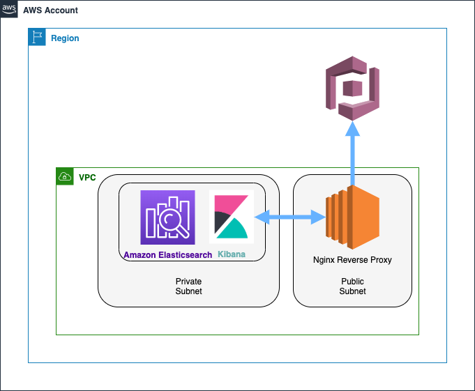

# Network-safe Elasticsearch Domain and Authenticated Kibana Dashboard
---
This template is used to create an Elasticsearch cluster in private subnet space, including Cognito authentication for Kibana Dashboard access through a Nginx reverse proxy server.

_Note: This template is meant to be used as a starting point, and is not production ready. For example, the Nginx reverse proxy generates a self-signed TLS/SSL certificate, which is not recommended for production usage._



<br /><br />

## Getting Started
---
This project takes advantage of the AWS CLI to deploy the template. A set of CLI credentials (*AccessKey and SecretKey*) with permissions to deploy all of the resources defined in the template is required.

<br /><br />

## Prerequisites
---

* Installing AWS CLI:  https://docs.aws.amazon.com/cli/latest/userguide/cli-chap-install.html
* Configuring AWS CLI: https://docs.aws.amazon.com/cli/latest/userguide/cli-chap-configure.html

<br /><br />

## Deploying the Templates via AWS CLI for the first time
---

### Parameters
Review and update the parameters for each template in the deployment. They are currently configured to work with the Oregon (us-west-2) Region.

Below is an example of how the parameters should be organized by region if this deployment extends into multiple regions for any reason:

```
parameters
└── us-west-2
    └── parameters.json
```

Parameter files are located in the project directory under the [Parameters/](./parameters) directory. For example, the [parameters.json](./parameters/us-west-2/firehose/parameters.json) file associated with the Kinesis Firehose deployment(s) is structured as a list of stringified `key=value` pairs:

```
[
  "CognitoAdminUserEmail=user@example.com",
  "CognitoDomainName=kibana-user-pool-domain-example",
  "DomainName=demo-domain",
  "DedicatedMasterEnabled=true",
  "ElasticsearchVersion=7.1",
  "EncryptionEnabled=true",
  "KmsKeyId=1a2b3c4-ab12-cd34-ef56-d5e6f7g8h9i0",
  "VpcId=vpc-00000000000000000",
  "PrivateSubnetIds=subnet-private1111111111,subnet-private2222222222",
  "ZoneAwarenessEnabled=true",
  "KeyName=admin-user",
  "ProxyServerInstanceType=t3.micro",
  "ProxyServerPublicSubnet=subnet-public33333333333"
]
```

<br /><br />

### Define all necessary resource tags in a json file:

*`tags.json`*:
```
[
    "Business_Unit=CloudEngineering",
    "Owner=Jane Doe",
    "Project=Cross Account Delivery Stream"
]
```

<br /><br />

### Deploying the template with the AWS CloudFormation CLI

```
aws cloudformation deploy \                                                                                                                ⏎
    --stack-name demo-domain \
    --template-file templates/private-domain.yaml \
    --parameter-overrides file://parameters/us-west-2/parameters.json \
    --tags file://tags/tags.json \
    --capabilities CAPABILITY_IAM \
    --region us-west-2 \
    --profile default
```

<br /><br />

 ## Authors
 ---

* Scott Schmidt - [1Strategy](https://www.1strategy.com)

<br />

## License
---
Copyright 2019 1Strategy

Licensed under the Apache License, Version 2.0 (the "License"); you may not use this file except in compliance with the License. You may obtain a copy of the License at

http://www.apache.org/licenses/LICENSE-2.0

Unless required by applicable law or agreed to in writing, software distributed under the License is distributed on an "AS IS" BASIS, WITHOUT WARRANTIES OR CONDITIONS OF ANY KIND, either express or implied. See the License for the specific language governing permissions and limitations under the License.

<br />

## References
---
* AWS CloudFormation Best Practices: https://docs.aws.amazon.com/AWSCloudFormation/latest/UserGuide/best-practices.html
* AWS CloudFormation Template Reference: https://docs.aws.amazon.com/AWSCloudFormation/latest/UserGuide/template-reference.html


